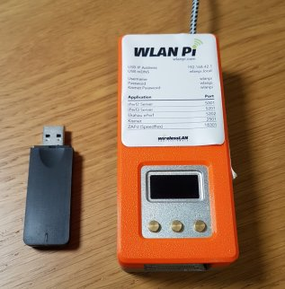
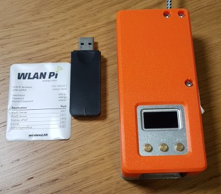
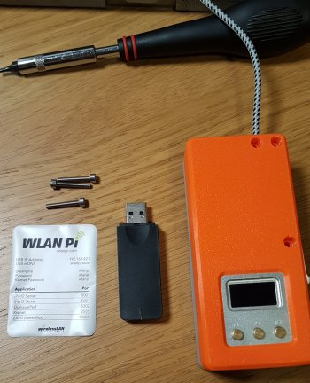
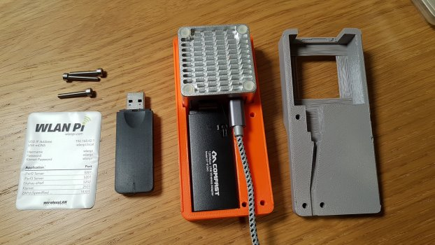
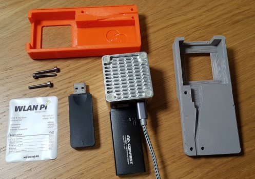
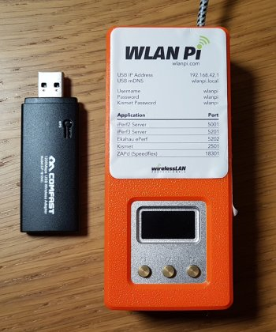

Title: Issues With CF-912AC Frame Capture 
Authors: Nigel Bowden

# Issues With CF-912AC Frame Capture

*8th March 2021 - Author: Nigel Bowden*

__If you've been seeing issues with missing data frames in your over-the-air captures using the WLAN Pi, this article may provide some useful advice in fixing a known wireless frame capture issue.__

The CF-912AC Comfast adapter has long been the "go-to" adapter for use with the WLAN Pi. It is a 2-stream adapter that provides support for PHYs up to 802.11ac.  It uses the Realtek RTL8812AU wireless chipset. It is very versatile when considering the various options it provides for the WLAN Pi, including: acting as an 802.11ac client, supporting monitor mode, packet injection and AP mode. This allows the WLAN Pi to perform a wide variety of actions, such as over the air packet capture and acting as a simple AP.

Since the adoption of the NEO2 platform for the WLAN Pi project, obtaining stable drivers for the CF-912AC has been an ongoing challenge. Thanks to the ongoing, excellent efforts of Jerry Olla, the project has managed to source and include drivers of reasonably good quality to provide many of the WLAN Pi Wi-Fi related features.

The WLAN Pi team recently had a report from one of our kind users (thanks [Juan!](https://twitter.com/ibanezjuan_){target=_blank}) that during an over-the-air capture, the WLAN Pi appeared to be only capturing data frames running at basic rates. After further investigation by the WLAN Pi team, it became apparent that 802.11ac data frames that were sent using 2 spatial streams were not being captured. Single stream 802.11ac data frames were captured OK. 802.11n 1 & 2 spatial stream data frames and all legacy rate data frames were also captured with no issues. All management and control frames (which all run at legacy rates anyhow) were also fine.

This is a suspected issue with the Realtek driver, so there is little we can do to fix the 2 stream 11ac capture issue. During testing, it was noted that there may be the occasional 2SS 11ac data frames observed, but this was sporadic and unpredictable. The issue has been [reported by other users](https://github.com/aircrack-ng/rtl8812au/issues/635){target=_blank} of the chipset driver, and we have added our own reports of the observed issue. The issue may be fixed at some stage, but as this issue appears to have been present for quite some time, this is unlikely to be fixed in the short-term.

(__Note:__ *Remember, the CF912 NIC is an 802.11ac, 2 stream device. Any data frames that use 802.11ac, 3 spatial streams will never be captured by the NIC. Also, no 802.11ax data frames can be captured by the NIC.*)

## Alternative NIC

Since version 2.x of the WLAN Pi image, support for MediaTek USB wireless adapters has been included. The team has received reports that Linux driver support for the MediaTek adapters is generally better than for RealTek drivers (for the features that we wish to use). 

Testing by the team over the past few months has indicated that the MediaTek MT7612U driver seems to perform very well and has no issue with the 2-stream over-the-air capture. The Mediatek MT7612U adapter option has become a favourite among the developer team.

However, sourcing a USB NIC that contains this chipset has not been without its challenges :)

Internally, the dev team has settled on what is internally referred to as the "no-name" MediaTek adapter - this is an unbranded, generic adapter. The easiest place to source this adapter is currently the AliExpress store, and is available from many different suppliers. Here is once source that I have used: [https://www.aliexpress.com/item/1005001510706842.html](https://www.aliexpress.com/item/1005001510706842.html){target=_blank}. If you search for the phrase `"New arrival Black MT7612U"` on [Aliexepress](https://www.aliexpress.com){target=_blank}, you will see that there are many suppliers of this USB dongle to choose from. When ordering, you can expect delivery to typically take a few weeks.

(*Hopefully, perhaps some of our suppliers may pick up on this requirement and make these more easily available...*)

## NIC Swap-out 

The good news is that if/when you obtain one of these adapters and have the orange-case WLAN Pi kit, it is very easy to swap out the CF-912 NIC inside the case for the no-name MT7612U adapter. I've provided a few photos below, taken when I swapped out my own CF-912 recently. In summary, you will need to:

1. On older cases the sticker needs to be removed as bolt heads are under the sticker. On newer cases, the bolts heads are accessible from the rear of the case, so sticker removal not required.
2. Use a hex spanner to undo the 3 retaining bolts
3. Remove the micro-SD card
3. Prise the plastic case top/bottom sections apart
4. Take out the Neo2
5. Swap over the CF-912 USB NIC for the MT7612 USB NIC
6. Put the Neo2 back in the case
7. Put the case back together
8. Re-insert the micro-SD card 
9. Re-install the retaining bolts
10. (On older cases only) Re-apply the front panel sticker

 
WLAN Pi case & new MT7612U adapter

 
On older cases the sticker needs to be removed as bolt heads are under the sticker. On newer cases, the bolts heads are accessible from the rear of the case, so sticker removal not required

 
Remove the 3 hex-head bolts and make sure the micro-SD card is removed (flip over the case to locate the micro-SD card - press the card in and it will pop out on a spring release)

 
Prise the two halves of the case apart to reveal the Neo2 and the CF-912 USB NIC

 
Take the Neo2/USB NIC assembly out of the case

 
Swap out the CF912 USB adapter for the new MT7612U adapter

 
Put the Neo2/USB assembly back in to the bottom half of the case (making sure to locate the USB cable correctly in the provided cable channel)

 
Clip the two halves of the case back together, re-insert the 3 retaining bolts, re-insert the micro-SD card and (on older cases only) re-apply the sticker

## RPi Support

Finally, another good reason to get hold of a MediaTek adapter is that if you have a Raspberry Pi, then the MediaTek adapter is supported on recent RPi images and will support monitor mode. This opens up interesting possibilities for using an RPi for remote over-the-air capture operations (e.g. capture with Wireshark (using the [extcap plugin](https://github.com/wifinigel/wlan-extcap-win){target=_blank}) or a tool such as [Airtool](https://www.intuitibits.com/products/airtool/){target=_blank})

## Further Questions

If you have any questions, please contact the WLAN Pi team via our [discussions forum on GitHub](https://github.com/WLAN-Pi/releases/discussions){target=_blank}.

[<-- back][back]

<!-- Link list -->
[back]: index.md
