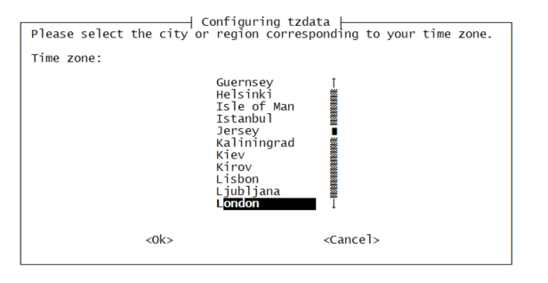

Title: Change the Timezone of a WLAN Pi
Authors: Nigel Bowden

# Change the Timezone of a WLAN Pi

By default, the WLAN Pi may not be configured to use your local timezone. This may cause timestamps in logs and other reporting areas to report times that are not correct for your locality.

To configure your WLAN Pi to use your local timezone, access the CLI of the WLAN Pi and execute the following command to launch a wizard that will guide you through the timezone selection process.

From the CLI of your WLAN Pi execute the following command to launch the on-screen text-based wizard to configure your local timezone:

```
sudo dpkg-reconfigure tzdata
```




[<-- back][back]

<!-- Link list -->
[back]: index.md
