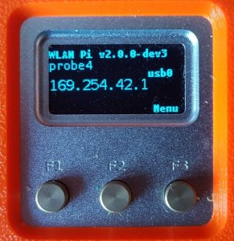

Title: Frequently Asked Questions
Authors: Nigel Bowden

# FAQ

## I hear the NEO2 is no longer available - when will replacement hardware be available?

The original WLAN Pi platform was based on the [NEO2 SBC Kit][Friendlyarm]{target=_blank} which was available from the Friendly Elec company in China. However, due to a lack of availability of some components for the board, they ceased production of the NEO2 board and hence the NEO2 kit. 

The NEO2 kit comprised the NEO2 board, an OLED display board, metal case and an SD card. Theoretically, if you can find a NEO2 board in some dusty corner of the Internet, you could still put together your own kit, as the remaining kit items are still available from Friendly Elec. 

It's also worth checking our [suppliers][suppliers] page to see if they have any kits available. They may occasionally obtain some surplus stock, if and when they can find it, so may have the NEO2 kit in stock in limited numbers from time to time.

To answer the question about replacement hardware, the honest answer is that there is no definite date for a replacement hardware platform being available. The team has recently looked at the new NEO3 board from Friendly Elec, but this has been discounted as a replacement at this time due to a number of technical limitations which ruled it out.

The "Rock Pi E" SBC was considered as a possible successor to the NEO2, but after investigation, there were a number of challenges which meant that it was discounted from further consideration.

The team is currently investigating (yet another!) alternative SBC as a possible replacement to the NEO2. This will require an additional carrier board/HAT to provide additional features and connectivity that are on our requirements list. It's always tricky to provide exact timescales, but as of March 2021, we are hopeful of having a finalised platform within around a 3 months time-frame. As we move closer to finalising hardware details, we will be able to provide a more accurate timescale assessment - stay tuned!


## Where can I get hold of a WLAN Pi kit?

Please check out our [suppliers page][suppliers] for the latest information on WLAN Pi hardware availability.

## Where can I get the latest WLAN Pi image?

You can obtain the latest base image from the releases area of the WLAN Pi GitHub repository (look for the assets section that contains the image - the file name will be something like: ```wlanpi-neo2-v2.0.0.img.gz```):

[https://github.com/WLAN-Pi/releases/releases](https://github.com/WLAN-Pi/releases/releases){target=_blank}

Once downloaded, you can burn it on to an SD card as described in the following administration document: [Burning a WLAN Pi Image][burn_image]

## How do I find which image version is currently installed on my WLAN?

If you look on the top-level "home" page of the front panel display, the version number of the image should be shown on the top right of the display:
<div></div>

If you are the CLI of the WLAN Pi, you may also check by performing the following command:

```
wlanpi@wlanpi:/$ cat /etc/wlanpi-release
VERSION="2.0.0-dev3"
```

## How do I burn a WLAN Pi image?

Checkout this administration note: [Burning a WLAN Pi Image][burn_image]


## How do I update software packages on the WLAN Pi?

Checkout this administration note: [Burning a WLAN Pi Image][[updating_packages]


## How do I change the password for the wlanpi user?

Checkout this administration note: [Change the Password of the wlanpi User][change_pwd]

**If connecting the WLAN Pi to any network, changing the default password should be a top priority. If the WLAN Pi becomes compromised as default credentials have been left in place, this could have very serious consequences.**


## How do I change the hostname of my WLAN Pi

Checkout this administration note: [Change the hostname of a WLAN Pi][hostname]


## How do I set the timezone on my WLAN Pi?

Checkout this administration note: [Change the Timezone of a WLAN Pi][timezone]


## How do I connect my WLAN Pi to my wireless network?

Checkout this administration note: [Connecting You WLAN Pi to a Wireless Network][wifi_client]

## Why do I see missing data frames when capturing over the air with the WLAN Pi

Checkout this administration note: [CF-912 Capture Issues][cf912_capture_issues]

##  I'd like to 3D print my own WLAN Pi case - are the printer plans available?

Yes, check out the following links:

* [https://www.prusaprinters.org/prints/16184-wlan-pi-handheld-case](https://www.prusaprinters.org/prints/16184-wlan-pi-handheld-case){target=_blank}
* [http://www.potatofi.com/2019/10/the-wlan-pi-handheld-case.html](http://www.potatofi.com/2019/10/the-wlan-pi-handheld-case.html){target=_blank}


## I'm having difficult getting a connection over the USB link to my WLAN Pi? What's going on?

The WLAN Pi has a very useful feature that allows you to connect your Mac or Window machine to a WAN Pi via a USB connection. This is effectively an Ethernet over USB connection, also known as an OTG connection (On The Go).

This requires a USB to micro-USB cable to hook up your laptop/Mac to the micro-USB socket on the WLAN Pi (which is also used to power the WLAN Pi).

This is very cool as it both powers up your WLAN Pi and gives you a local network connection to the WLAN Pi so that you can SSH or browse in to it.

There are two main issues we have seen with connectivity over the OTG connection:

1. Some cables that look like an OTG cable (i.e. a regular USB plug on one end and a micro-USB on the other) are, in fact, just phone charger cables and only have the power wires through. This means there are no data wires and you can never establish the OTG connection. The WLAN Pi will power up, but the OTG connection will not work. (You can check if you have an OTG connection by looking at the network interfaces on your laptop/Mac - if OTG is working, a new Ethernet port automagically appears.) 
If you hit this issue, try another cable (or two)

2. The second issue we hear about impacts Windows users. Please check out this super blog post if you have a Windows laptop and you think your cable is good: [Blog Post Link][Win10_Host_Issue]

# On Windows I see the USB connection to the WLAN Pi as a serial port rather than an Ethernet port. Why?

In this [blog article][Win10_Host_Issue], Patrick Langendoen discusses how to fix an issue on Windows machines with detecting the USB connection to a WLANPi as a serial port, rather than the expected USB Ethernet /RNDIS interfaces: [link][Win10_Host_Issue]

## Which wireless adapters are supported on the WLAN Pi ?

Please checkout our [Supported Hardware][supported_hardware] page.

## Where can I get help support with my WLAN Pi?

Support is on a volunteer/best efforts basis by project volunteers. Try [here][support]

## How do I suggest a new feature for the WLAN Pi?

If you have a feature suggestion for the WLAN Pi, please get along to the GitHub site for the project and open an issue ticket with your suggestion: [link][suggestions] (this will need a (free) GitHub account to create an issue)

<!-- Link list -->
[support]: support.md
[suppliers]: suppliers.md
[wlanpi_releases]: https://github.com/WLAN-Pi/wlanpi/releases
[burn_image]: https://youtu.be/sD4WlNyyWDs
[adapter_sheet]: https://docs.google.com/spreadsheets/d/1yAjO2vZuIfJ9BwI5cQ_qu72HpyEuETj4Zd7bWBnskDM/edit#gid=0
[suggestions]: https://github.com/WLAN-Pi/wlanpi/issues
[Win10_Host_Issue]: https://dutchwifigeek.blogspot.com/2019/10/using-wlan-pis-usb-host-interface-in.html
[burn_image]: admin/burn_image.md
[hostname]: admin/hostname.md
[change_pwd]: admin/change_pwd.md
[timezone]: admin/timezone.md
[wifi_client]: admin/wifi_client.md
[updating_packages]: admin/updating_packages.md
[Friendlyarm]: https://www.friendlyarm.com/index.php?route=product/product&product_id=189
[supported_hardware]: supported_hardware.md#wireless-adapters
[cf912_capture_issues]: admin/cf912_issues.md
