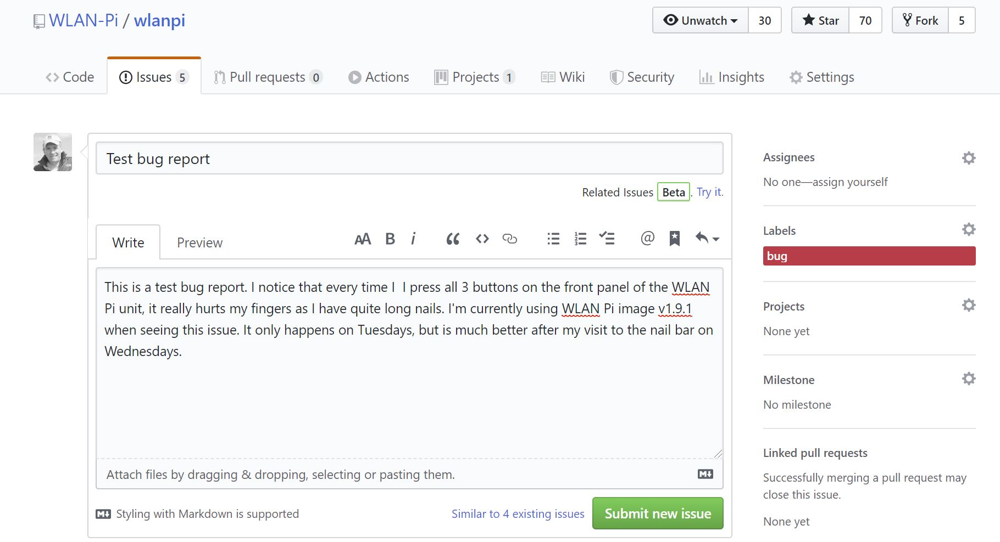

Title: Getting Involved - Bug Reporting
Authors: Nigel Bowden

# Getting Involved - Bug Reporting

If you're a WLAN Pi user and you think you spot a bug that we need to know about, please drop us a bug report.

The best method for doing this is to visit the WLAN Pi GitHub site and submit a bug report. If you visit the following page, you will be able to open a new issue:

https://github.com/WLAN-Pi/wlanpi/issues

If you hit the "New Issue" button, you will be presented with a form where you can enter the bug details. Please provide as much information as possible about:

* The image version being used (show on the WLAN Pi initial power-up home screen)
* How we can re-create the issue
* Any useful log files you may have been able to obtain (note that attachment files can be dragged in to the bug report form area)
* Any useful screen shots of pictures you have obtained to demonstrate the issue  (note that attachment files can be dragged in to the bug report form area)

Also, if possible, mark the issue as a bug using the label drop-down on the right of the web form.

Once you have submitted the bug, an email alert will be generated by a team of people and it will be forwarded on to the relevant person. Please be patient whe waiting for a response, as we are all volunteers doing this in our spare time.

<!-- link list -->
[nigel_twitter]: https://twitter.com/wifinigel
[jerry_twitter]: https://twitter.com/jolla

<small> <i>Page last updated: {{ git_revision_date }} </i></small>