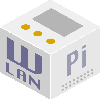

Title: WLAN Pi documentation project home page
Authors: Nigel Bowden

# Welcome to the WLAN Pi Documentation Project

**Welcome to the WLAN Pi documentation site.**

The WLAN Pi initiative started at the [Wireless LAN Professionals Conference][WLPC_2016] in 2016. Since then, the WLAN Pi has grown in to a popular addition to the toolset of many WLAN engineers. 

The project is constantly adding and improving the tools available on the WLAN Pi platform to provide a richer toolset to our loyal base of users. 

This site has been created to provide supporting documentation to the project, to make the WLAN Pi even more accessible to new and existing users.

On this site we will provide information to enable you to buy or build your own WLAN Pi, detail the packages available on the current WLAN Pi image and provide update information about the WLAN Pi project.

If you're new to the WLAN Pi project, a great place to start is our [Getting Started][Getting_Started] page.

Got a

<!-- Link list -->
[WLPC_2016]: https://www.wlanpros.com/resource/?wpv-category=2016-us-phoenix&wpv_aux_current_post_id=2623
[Getting_Started]: getting_started_overview.md

