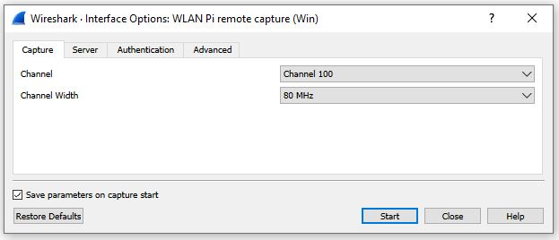

Title: Extcap
Authors: Nigel Bowden

# extcap

The [extcap project][extcap-github-mac] was originally created by Adrian Granados. 

The utility is a wrapper around the SSHDump feature provided in Wireshark 3.x. Extcap feature is not actually a package on the WLAN Pi, but is an external utility that allows the WLAN Pi to be used as a remote capture device using Wireshark. It needs to be installed on the laptop where Wireshark is installed. It also provides additional options within Wireshark to allow the configuration of the WLAN Pi device to start a remote wireless frame capture. 

A [Windows version of the extcap project][wifinigel-blog] was created by Nigel Bowden, providing a Windows-native version of the utility. The video below shows how to use the extcap feature in Wireshark, using the WLAN Pi as a capture source.

<iframe width="560" height="315" src="https://www.youtube.com/embed/VQx38OfPrKI" frameborder="0" allow="accelerometer; autoplay; encrypted-media; gyroscope; picture-in-picture" allowfullscreen></iframe>

Checkout these useful links for more information about extcap:

- [Wireshark Plugin To Capture Wireless Frames Using a WLANPi (Windows 10)][wifinigel-blog]
- [Githib: Wireshark extcap interface for remote wireless captures][extcap-github-mac]
- [Github: Wxtcap for Windows][extcap-github-win]

<!-- Link list -->
[extcap-github-win]: https://github.com/wifinigel/wlan-extcap-win
[extcap-github-mac]: https://github.com/adriangranados/wlan-extcap
[wifinigel-blog]: https://wifinigel.blogspot.com/2019/11/wireshark-plugin-to-capture-wireless.html

