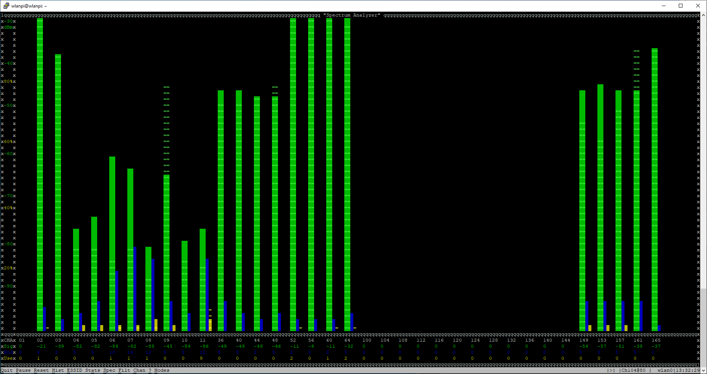

Title: Horst
Authors: Ian Stout

# Horst

horst is a small, lightweight IEEE802.11 WLAN analyzer with a text interface. It's a Linux program and can be used on any wireless LAN interface which supports monitor mode.

Its basic function is similar to tcpdump, Wireshark or Kismet, but it's much smaller and shows different, aggregated information which is not easily available from other tools. It is made for debugging wireless LANs with a focus on getting a quick overview instead of deep packet inspection and has special features for Ad-hoc (IBSS) mode and mesh networks. 

It can be useful to get a quick overview of what's going on all wireless LAN channels and to identify problems. It includes the following features:

* Shows signal (RSSI) values per station, something hard to get, especially in IBSS mode
* Calculates channel utilization (“usage”) by adding up the amount of time the packets actually occupy the medium
* “Spectrum Analyzer” shows signal levels and usage per channel
* Graphical packet history, with signal, packet type and physical rate
* Shows all stations per ESSID and the live TSF per node as it is counting
* Detects IBSS “splits” (same ESSID but different BSSID – this is/was a common driver problem on IBSS mode)
* Statistics of packets/bytes per physical rate and per packet type
* Has some support for mesh protocols (OLSR and batman)
* Can filter specific packet types, operating modes, source addresses or BSSIDs
* Client/server support for monitoring on remote nodes
* Automatically adds and removes monitor interface

## Usage

horst needs sudo permissions to run, and has a few command line switches, the most notable one to use is –C which allows you to set the channel used, see the man page for a complete listing. 

After launching the program, pay attention to the bottom left of the program which will allow you to access the different menu options:

Press C to access the channel menu and changes:

Horst will also display some stats as to what type and how many types of a frame it is receiving:

Lastly horst is a poor man’s spectrum analyzer, which will allow you to see some basic info regarding the channel:

horst is another application that hasn’t been updated in some time and may have some bugs or may not work with the latest hardware. 

More info can be found in the man page or at [https://github.com/br101/horst]

<!-- Link list -->

<small><i>(Contributed by Ian Stout)</i></small>

<small> <i>Page last updated: {{ git_revision_date }} </i></small>