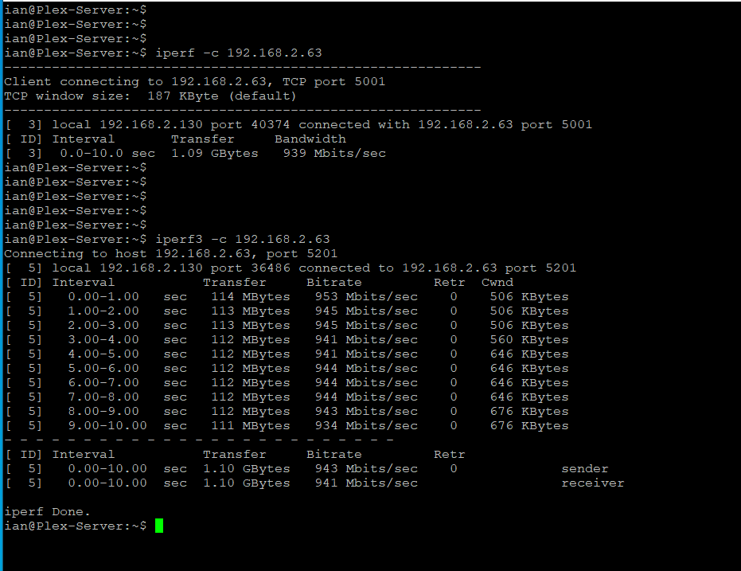
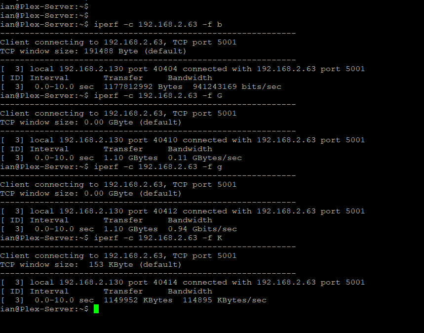
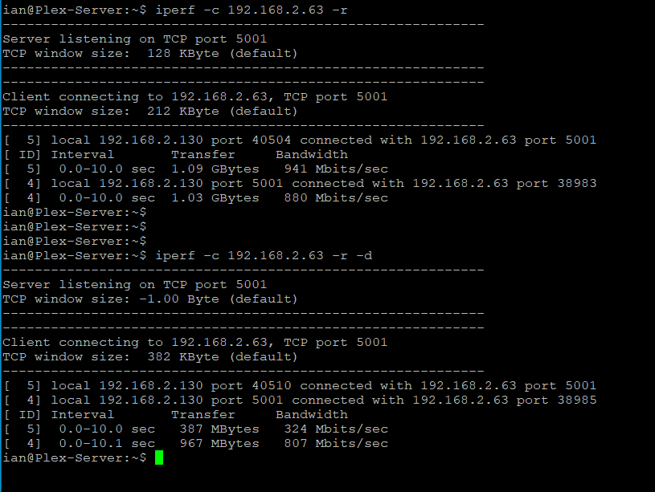
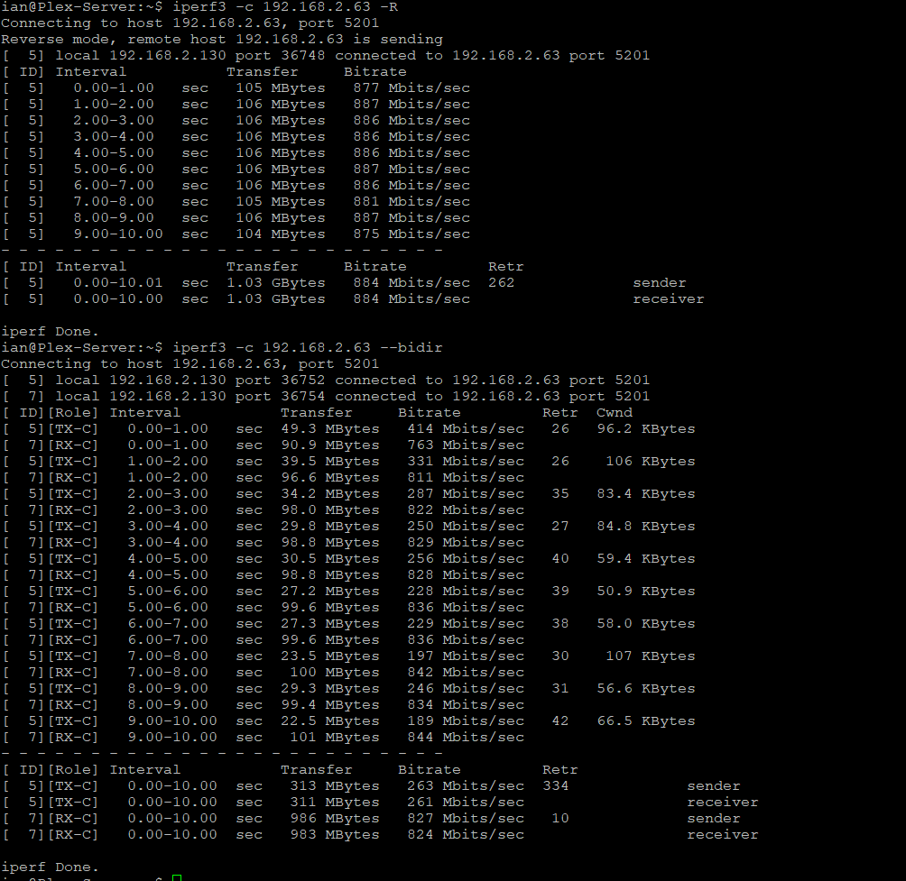
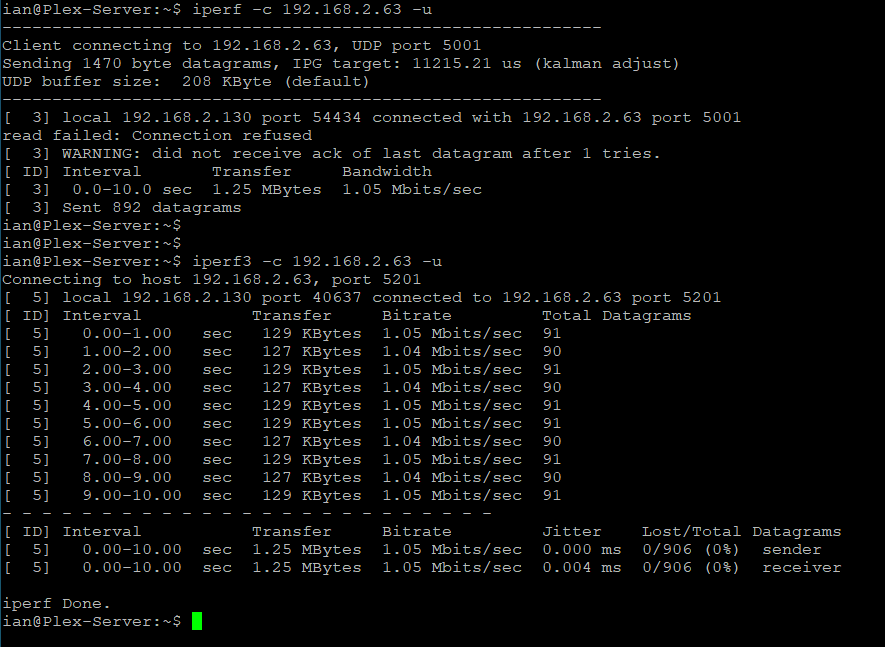

Title: iperf
Authors: Ian Stout/Nigel Bowden

# iperf
iperf  is a tool for performing network throughput measurements.  It can test either TCP or UDP throughput.  To perform an iperf test the user must establish both a server (to receive traffic) and a client (to generate traffic).

The WLAN Pi has iperf2 and iperf3 servers running upon start-up, these servers are using the default options for each version. 

For reference, iperf uses the following ports:
```
iperf2 - 5001
iperf3 - 5201
```

Iperf3 is a rewrite of iperf from scratch to create a smaller, simpler code base. Iperf3 is not backwards compatible with iperf2.

## Usage
To view all iperf options, take a look the manual pages for the software using the following CLI command in your SSH session (hit 'q' to quit the man pages) or use the -h or --help flag for listing of the commands:

```
man iperf
iperf -h

man iperf3
iperf3 -h
```

## Examples
### Basic throughput test

(Note that by default, iperf tests using TCP. To use UDP, see later examples.)

```
iperf -c <server_ip>
iperf3 -c <server_ip>
```



### Displaying data formatted in different units. 
The units that in which results are displayed (i.e. Kilobits per sec, Megabits per sec etc.) may be modified using the following command attributes:
```
iperf -c <server_ip>  -f (b, B, k, K, m, M, g, G, t, T)
iperf3 -c <server_ip>  -f (b, B, k, K, m, M, g, G, t, T)
```



### iperf from server to client (reverse direction test) or bi-directional test
```
iperf -c <server_ip>  -r -d
```


 
```
iperf3 -c <server_ip>  -R or iperf3 -c <server_ip>  --bidir
```




### iperf using udp
```
iperf -c <server_ip> -u
iperf3 -c <server_ip> -u
```




## References
The following references may be useful for further information about iperf:

* [iperf home page][Home_Page]
* [iPerf2 vs iPerf3 | Panos Vouzis | WLPC Phoenix 2020][WLPC_Video]
* [It's not the Network | Panos Vouzis | WLPC Phoenix 2018][WLPC_Video2]

<!-- Link list -->
[Home_Page]: https://iperf.fr/
[WLPC_Video]: https://youtu.be/nZOtocu12hw
[WLPC_Video2]: https://youtu.be/pC4oQQ8gfZs

<small><i>(Contributed by Ian Stout)</i></small>


