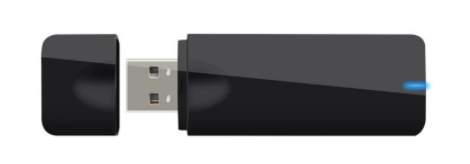

Title: WLAN Pi Supported Hardware
Authors: Nigel Bowden

# Supported Hardware

The software distribution and tools developed for the WLAN Pi are tested with a number of primary hardware components. The items have been to work well for the purposes of the WLAN Pi toolset. These are the devices that are listed below as the "recommended" devices to use for the WLAN Pi.

As the WLAN Pi software distribution is based on Linux, it may operate with a number of other components, which you are free to try for your own purposes. However, the development team strongly recommend you use only the components listed below for the widest and most reliable feature support.

One area that has many options is WLAN adapter support. The WLAN Pi distribution supports a variety of RealTek and Mediatek adapters. However, the chipsets supported are limited, and the features supported are highly variable between adapters. Again, feel free to experiment with any adapters you may have lying around in your bag of dongles at home, but be mindful of the fact that even if they appear to work OK, their feature set may well be limited. The WLAN Pi developers maintain a Google sheet that shows the features that have been verified during our testing, which may be of help if you like to experiment: [Wireless Adapter List][dongle_doc]{target=_blank} (_This is not an exhaustive list of all adapters that may work, there may be others - make sure you pay attention to the "supported modes" row in the sheet when choosing your adapter_)

## Base Platform 

### FriendlyArm NEO2 Kit

The WLAN Pi platform is built using the [FriendlyArm NanoPi NEO2 Kit][NEO2]{target=_blank}. The NEO2 kit comprises the NEO2 board, an OLED display board, metal case and an SD card. 

The NEO2 is a super tiny quad-core single-board computer (SBC). The NanoPi NEO2 shares some similarities to the more well known Raspberry Pi, however the NanoPi is less than ½ its size, consumes less power, and it can push over 900 Mbps over its gigabit ethernet connection.

Specs:

- CPU: Allwinner H5, Quad-core 64-bit high-performance Cortex A53
- DDR3 RAM: 1GB
- Storage: microSD (16 GB card included), can be expanded up to 128GB

More info: <http://wiki.friendlyarm.com/wiki/index.php/NanoPi_NEO2>

Unfortunately, as of April 2020, FriendlyArm are no longer producing the NEO2 board due to component supply issues. There may be limited numbers of kits available periodically from our listed [suppliers][suppliers] and other online suppliers with old stock, but they are generally unavailable.

We are working on sourcing a replacement base hardware platform - see [here][availability]

(_Check out our [suppliers][suppliers] page for guidance on where to purchase this item_)

## Wireless Adapters

### Comfast CF-912 Adapter

The Comfast CF-912 adapter is a 2 spatial stream, dual band, 802.11ac device. It uses a Realtek 8812au chipset and has been the adapter of choice for the WLAN Pi since the early 1.x days of the project. It supports monitor mode and packet injection, so is great for over the air packet capture work. 

The CF-912 is good for most application but has a slight weakness, as it may report spurious RSSI values in RadioTap headers, causing strange looking RSSI values when inspecting frames with tools such as Wireshark and Wi-Fi Explorer.

(_Check out our [suppliers][suppliers] page for guidance on where to purchase this item_)

### Generic MT7612U Adapter

This is a "no-name" adapter that is available from a few online retailers. Despite its lack of branding, it works well with the WLAN Pi software (and it also fits inside the orange WLAN Pi case, which is a bonus). It uses a Mediatek MT7612U chipset and is very similar in spec to the CF-919AC (2SS, 802.11ac, monitor mode, packet injection). It has a slight advantage over the CF-912 as it reports sensible RSSI values in RadioTap headers. It has a second advantage over the CF-912, as it also reports frame MCS values (which are not reported by Realtek NICs). 

Mediatek NICs tend to have improved driver capabilities and stability in Linux compared to Realtek devices. Mediatek adapter support was added in the V2 image is likely to be the preferred adapter option for the WLAN Pi going forwards. 

(_Check out our [suppliers][suppliers] page for guidance on where to purchase this item_)

!!! info
    If you'd like to try out other wireless adapters, check out this [Wireless Adapter List][dongle_doc]{target=_blank} compiled by our developers. Many are not as fully featured as those recommended above, but may have limited use if they contain a specific feature you require.

<!-- Link list -->
[NEO2]: https://www.friendlyarm.com/index.php?route=product/product&product_id=189
[dongle_doc]: https://docs.google.com/spreadsheets/d/1yAjO2vZuIfJ9BwI5cQ_qu72HpyEuETj4Zd7bWBnskDM/edit#gid=0
[suppliers]: suppliers.md
[availability]: faq.md#i-hear-the-neo2-is-no-longer-available-when-will-replacement-hardware-be-available

